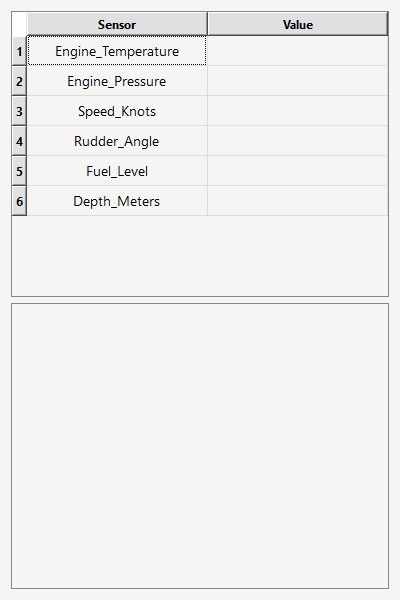

# 🚢 Naval Sensor Simulator

[](https://isocpp.org/) 
[](https://cmake.org/) 
[](https://www.qt.io/) 
[](https://github.com/google/googletest)
[](LICENSE)

**Naval sensor simulator with anomaly detection and Qt visualization.**  

This project is developed in **C++17** and simulates a basic sensor monitoring system (temperature, pressure, speed).  




The system includes:

- **Qt Widgets GUI** to display sensors in real-time.  
- Anomaly detection with visual highlighting in the table.  
- **Observer pattern** that supports multiple monitoring outputs: console, file, GUI.  
- Simulation cycles with random values, noise, drift, and random failures.  
- **Unit and integration tests** with GoogleTest.  

---

## ✨ Current Features

- Sensor simulation with **random values, noise, drift and failure probability**.  
- **Anomaly detection** when a value exceeds defined limits.  
- **Real-time visualization using Qt**, highlighting anomalies in the table.  
- Extensible **observer system** (console, file, GUI).  
- **Automated unit and integration tests** with **Google Test** and **CMake**.  
- Sensor configuration loaded from **JSON** files.  

---


## 📂 Project Structure
```
naval-sensor-simulator/
│── build/
|
│── docs/
│ ├── naval_simulator.gif
|
│── external/
│ ├── googletest/
│ ├── json/
│ 
│── src/
│ ├── main.cpp
│ ├── observer.h
│ ├── qt_observer.h
│ ├── sensor_system.cpp
│ ├── sensor_system.h
│ ├── sensor.cpp
│ ├── sensor.h
│ ├── simulation_report.h
│
│── tests/
│ ├── unit_test.cpp
│ ├── integration_test.cpp
│
│── sensors.json
│── CMakeLists.txt
│── LICENCE
│── README.md
```
---
## ⚙️ Sensor Configuration (sensors.json)

The simulation parameters are loaded from the sensors.json file.

Each sensor has the following parameters:

| Field | Description | Example |
|---|---|---|
| `name` | Sensor name | "Temperature" |
| `min` | Minimum acceptable value | 10 |
| `max` | Maximum acceptable value | 80 |
| `noise` | Random noise level (0 to 1) | 0.05 |
| `failureProbability` | Chance of sensor failure per cycle (0 to 1) | 0.05 |

This allows for easy and flexible configuration of the sensors without recompiling the code.

```json
{
  "sensors": [
    {"name": "Temperature", "min": 10, "max": 80, "noise": 0.05, "failureProbability": 0.05},
    {"name": "Pressure", "min": 5, "max": 50, "noise": 0.03, "failureProbability": 0.1},
    {"name": "Speed", "min": 0, "max": 40}
  ]
}
```
---

## 🛠 Installation and Build

### Requirements

- **C++17**  
- **Qt6 (Widgets)**  
- **CMake ≥ 3.16**  
- **MinGW** (for Windows)
- GoogleTest (for unit and integration tests)
- nlohmann/json (for reading sensor configuration from JSON files)

### Building on Windows

```
# Go to the build directory
cd build

# Generate build files
cmake .. -G "MinGW Makefiles"

# Compile the project
mingw32-make
```

### Building on Linux

```
#Navigate to the build directory (create it if it doesn't exist)
mkdir -p ~/NavalSensorSimulator/build
cd ~/NavalSensorSimulator/build

# Generate build files
cmake ..

# Compile the project
make
```

---
## ▶️ Execution

### Main Application
```
./NavalSimulator
```
- Runs the GUI and main sensor simulation.
- The Qt table updates in real time with each sensor's value.
- Anomalies are highlighted visually.


### Unit Tests
```
./UnitTests
```
Checks individual components: Sensor, SensorSystem, and their methods.


### Integration Tests
```
./IntegrationTests
```
Validates system-level behavior: interaction of sensors, sensor system, and observers.

---
## 💡 Future Improvements
- Real-time charts using Qt Charts.
- Export sensor data to CSV/JSON.
- Advanced visual alerts for critical anomalies.
- Correlation analysis between multiple sensors.
- Support for hundreds of sensors using QAbstractTableModel.

---
## 📄 License
This project is licensed under the MIT License. See LICENSE for details.
